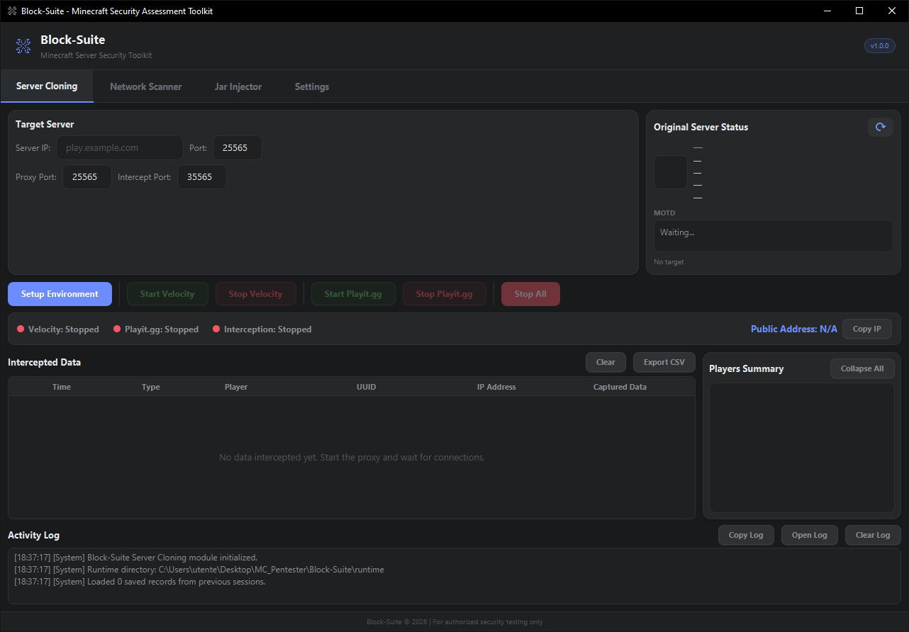
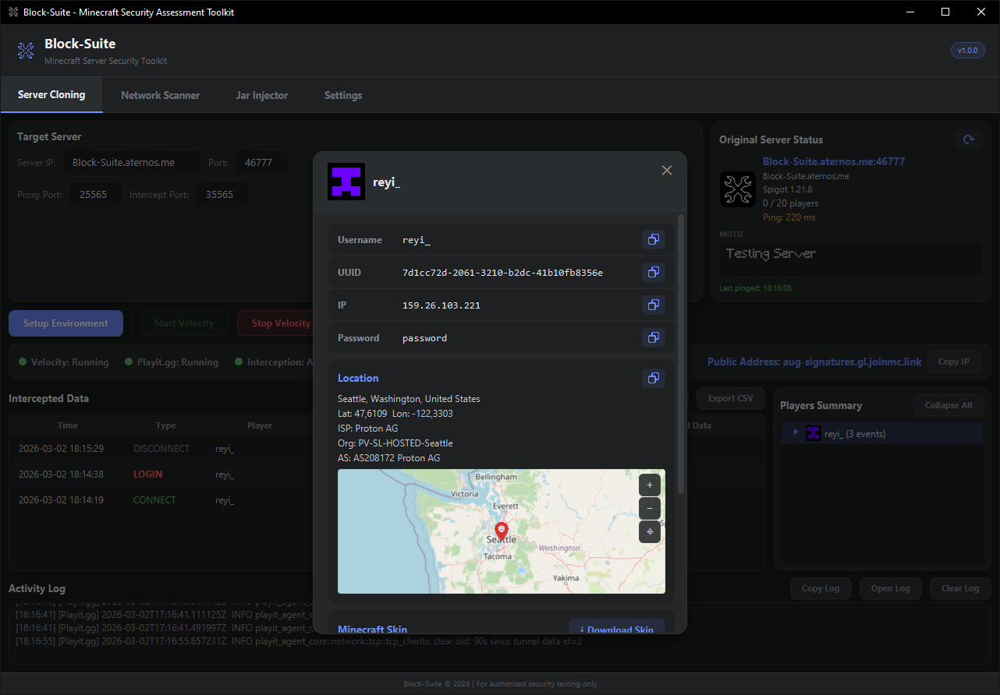

<p align="center">
  
</p>

<h1 align="center">Block-Suite</h1>

<p align="center">
  <strong>Minecraft Server Security Assessment Toolkit</strong><br>
  Test, intercept, analyze — from a single desktop application.
</p>

<p align="center">
  <a href="https://github.com/itsreyi/BlockSuite/releases/latest"></a>
  <a href="https://github.com/itsreyi/BlockSuite/releases"></a>
  <a href="https://block-suite.net"></a>
</p>

---

## What is Block-Suite?

Block-Suite is a modular desktop application built for **authorized Minecraft server security assessments**. It provides a collection of tools — each focused on a specific testing scenario — all managed through a JavaFX interface with built-in themes, auto-updates, and cross-version support.

## Features

| Feature | Status |
|---------|--------|
| **Server Cloning** — Transparent MITM proxy that mirrors any MC server | ✅ Available |
| **Data Interception** — Capture logins, credentials, UUIDs, IPs, skins | ✅ Available |
| **Player Intelligence** — Geolocation, interactive map, skin viewer, history | ✅ Available |
| **Playit.gg Tunneling** — Built-in tunnel, no port forwarding needed | ✅ Available |
| **Advanced Proxy Config** — Forwarding modes, HAProxy, BungeeGuard, compression | ✅ Available |
| **ViaVersion Support** — Cross-version protocol translation | ✅ Available |
| **5 Themes** — Dark Blue, Green Suite, Black Green, Purple Suite, Black Purple | ✅ Available |
| **Auto-Updates** — One-click updates from GitHub Releases | ✅ Available |
| **CSV Export** — Export all intercepted data | ✅ Available |
| More modules | 🔜 Planned |

## Screenshots

<p align="center">
  <br>
  <em>Main window — Server Cloning tab</em>
</p>

<p align="center">
  <br>
  <em>Player intelligence overlay with geolocation and skin viewer</em>
</p>

## Quick Start

### Requirements

- **Windows 10/11** (64-bit)
- **Java 17+** ([Adoptium](https://adoptium.net/) recommended)
- Internet connection

### Install & Run

1. Download the latest release from [**Releases**](https://github.com/itsreyi/BlockSuite/releases/latest)
2. Extract the ZIP to any folder
3. Run `Block-Suite.exe`

### First Clone

1. Enter a target server IP and port in the **Server Cloning** tab
2. Click **Setup Environment** — Block-Suite downloads and configures everything
3. Click **Start Velocity** to launch the proxy
4. Click **Start Playit.gg** to create a public tunnel
5. Share the public address — all data is intercepted in real-time

> 📖 Full documentation at **[block-suite.net](https://block-suite.net)**

## Architecture

```
Player's Minecraft Client
        │
        ▼
┌─────────────────────┐
│   Playit.gg Tunnel  │  ← Public address (no port-forwarding)
└─────────┬───────────┘
          │
          ▼
┌─────────────────────┐
│   Velocity Proxy    │  ← Runs locally, managed by Block-Suite
│  ┌───────────────┐  │
│  │ BlockSuite    │  │  ← Intercepts /login, /register, connections
│  │ Plugin        │──┼──→ TCP JSON → Block-Suite GUI
│  └───────────────┘  │
└─────────┬───────────┘
          │
          ▼
┌─────────────────────┐
│  Target MC Server   │  ← The real server being assessed
└─────────────────────┘
```

## Documentation

Full wiki and guides available at **[block-suite.net](https://block-suite.net)**:

- [Getting Started](https://block-suite.net/getting-started.html) — Download, install, first run
- [Server Cloning](https://block-suite.net/server-cloning.html) — Complete cloning tab reference
- [Playit.gg Setup](https://block-suite.net/playit-setup.html) — Tunnel configuration guide
- [Settings](https://block-suite.net/settings.html) — Themes, appearance, proxy options
- [Advanced Options](https://block-suite.net/advanced-cloning.html) — Forwarding modes, presets
- [Bug Report](https://block-suite.net/bug-report.html) — How to report issues

## Tech Stack

- **Java 21** (target 17) — Core application
- **JavaFX 21** — Desktop GUI
- **Velocity** — High-performance Minecraft proxy
- **Playit.gg** — Tunneling service
- **ViaVersion / ViaBackwards** — Cross-version support
- **Maven** — Multi-module build (`blocksuite-app` + `blocksuite-plugin`)

## Bug Reports

Found a bug? [Open an issue](https://github.com/itsreyi/BlockSuite/issues/new) with:
- Block-Suite version
- Steps to reproduce
- Activity Log output or screenshots

## Disclaimer

> ⚠️ **Block-Suite is intended for authorized security testing only.**
> Only use it on servers you own or have explicit written permission to test.
> Unauthorized access to computer systems is illegal. The developers assume no liability for misuse.

---

<p align="center">
  <sub>Made by <a href="https://github.com/itsreyi">itsreyi</a></sub>
</p>
